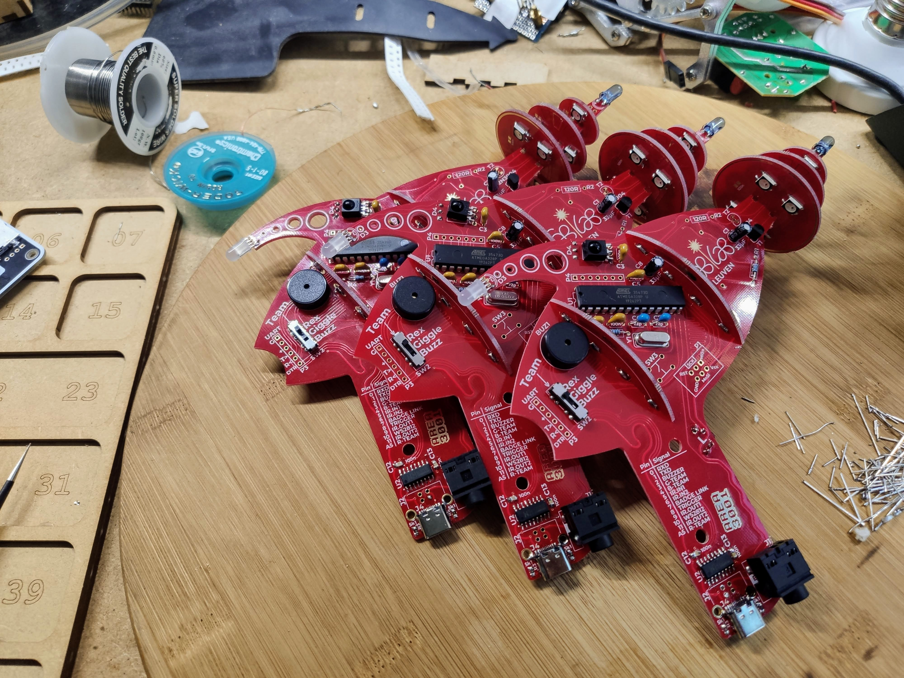
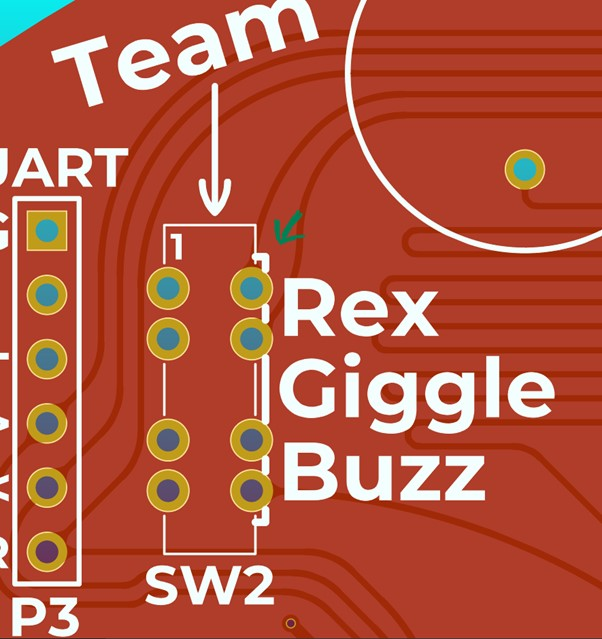
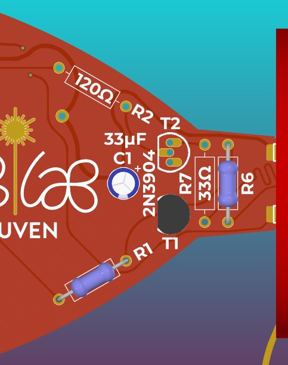

# Time Blaster

This repository contains the design files for the Time Blaster project part of Fri3d Camp 2020.

The design is based around an ATMega328p, some IR receivers and an IR LED.

The progress of this project can be followed on [Hackaday.io](https://hackaday.io/project/167668-time-blaster)

## Blockdiagram

In order to make the documentation easier to use, we've added the block diagram as well.

## Hardware Revision 00

## Hardware Revision 01

Added support for USB C and Micro USB. Fixed a bug with the USB Serial convertor, some pin swaps for firmware development.

## Hardware Revision 02

Added a series resistor for the IR LEDs, this is only required when powering the device from 5V.

# Assembly Instructions

## Resistor note

10KΩ resistor has been marked with a red permanent marker since the color coding for the 120Ω and 10KΩ resistor are to similar

## Trigger switch

Trigger switch side can be chosen depending on left hand or right hand use case

##Team selection switch

Take note of silkscreen on the PCB for correct placement of the Team selector switch.

 
## Microcontroller assembly note

Take care when mounting the ATMega328p microcontroller, don't heat up the pins too long to avoid damaging them. To avoid creating a hot spot, you can opt for alternating sides when soldering pins.

## Ring mounting
Mount the rings with SMD LEDs before you solder the IR LED in place.

## Which components to mount

R1 120Ω, MOSFET T1, R6 33Ω and IR LED D1 should be mounted 

 
Capacitor C4 (100nF), SW3 and right angle connector P3 are optional for Arduino style programming over FTDI UART connection.

## USB

Optional USB circuitry kits based around the CH340 USB to serial convertor are available upon request. These kits include an USB connector (USB-B, USB-C or Micro USB), 2 capacitors and the CH340 chip. In case of the USB-C variant, there will also be 2 resistors of 5.1kΩ included.
